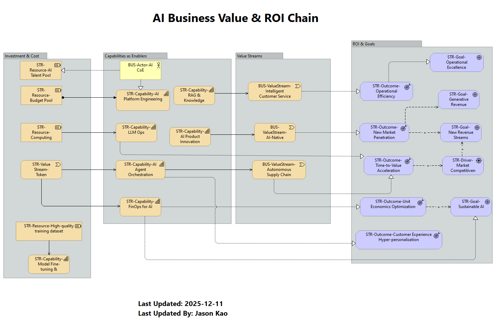

## 2. 💰 AI Business Value & ROI Chain (商業價值與投資回報鏈)
* **類型:** `Layered View`
* **目標受眾:** 🎯 CEO, CFO

這張視圖回答了 **"Show me the money"** 的問題。它展示了從資源投入到最終商業產出的完整因果鏈，證明 AI 是利潤中心而非單純的成本中心。

* **邏輯流向:**
    1.  **Investment:** 投入預算與算力資源。
    2.  **Capability:** 轉化為核心能力 (如 Agent Orchestration)。
    3.  **Value Stream:** 應用於具體業務流程 (如智慧客服、自動化供應鏈)。
    4.  **Outcome:** 產出具體成果 (如降低營運成本、縮短上市時間)。

> **💡 決策價值:** 連結 IT 投資與 P&L (損益表)，向 CFO 證明每一分預算如何轉化為 EPS (每股盈餘) 的增長動力。
