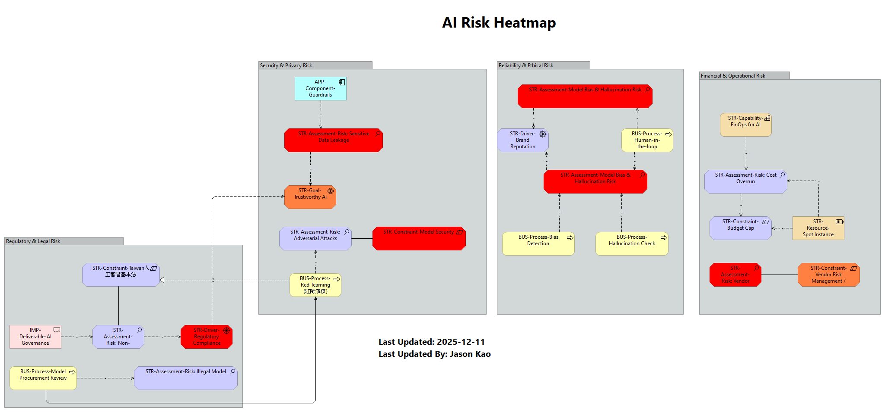

## 4. 🔥 AI Risk Heatmap (AI 風險熱點圖)
* **類型:** `Motivation View`
* **目標受眾:** 🎯 Audit Committee, CISO

以直觀的 **紅/橘/黃** 燈號展示組織面臨的重大威脅，並連結對應的防禦機制。

* **四大風險領域:**
    * **🔴 Regulatory:** 台灣人工智慧基本法 合規、著作權侵權、鉅額罰款。
    * **🔴 Security:** 敏感資料外洩 (Data Leakage)、提示詞攻擊 (Prompt Injection)。
    * **🟠 Trust:** AI 幻覺 (Hallucination)、偏見 (Bias)、決策不可解釋。
    * **🟡 Financial:** Token 成本失控、供應商鎖定 (Vendor Lock-in)。

> **💡 決策價值:** 讓審計委員會安心 (Sleep at night)。證明組織已經識別了所有重大威脅，並已部署了對應的控制措施 (Controls)。
