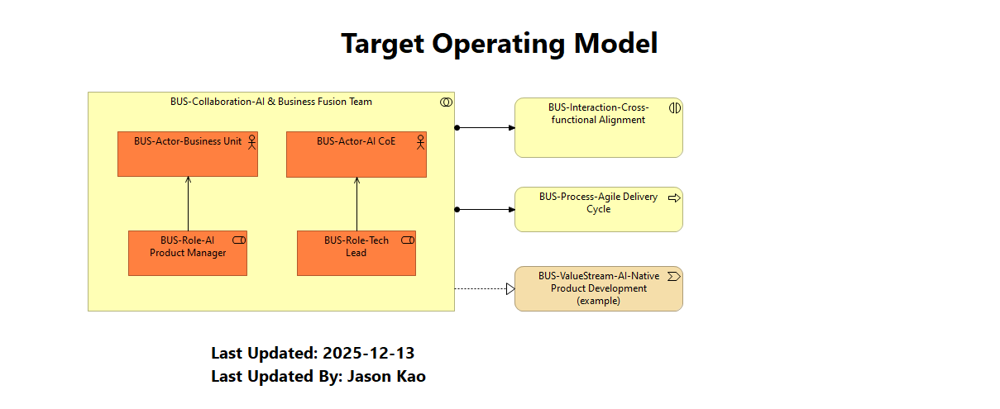

## 8. 🤝 Target Operating Model (目標營運模式 - TOM)
* **類型:** `Organization View`
* **目標受眾:** 🎯 CEO, COO

展示 IT 與業務部門如何打破穀倉 (Silos)，組成 **「AI & Business Fusion Team (跨部門團隊)」**。

* **協作模式:**
    * **Business Lead:** 由業務單位的產品經理 (PM) 領軍，確保商業目標優先。
    * **Tech Enabler:** 由 AI CoE (卓越中心) 派出技術專家賦能。
    * **Shared Goal:** 共同對價值流 (Value Stream) 的產出負責。

> **💡 決策價值:** 解決組織摩擦。確保技術團隊不是閉門造車，而是真正解決業務痛點。
