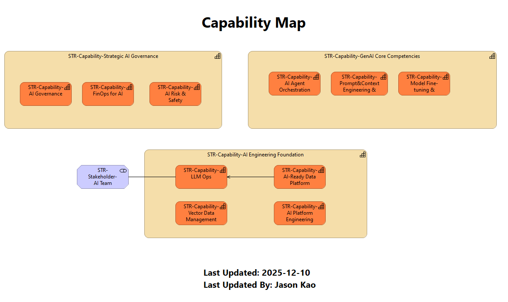

## 10. 🧩 Capability Map (能力地圖)
* **類型:** `Strategy View`
* **目標受眾:** 🎯 CIO或CTO

盤點組織目前擁有 (As-Is) 與未來需要建立 (To-Be) 的核心能力。

* **關鍵能力:**
    * **Differentiation:** AI Product Innovation (產品創新)。
    * **Foundation:** RAG Retrieval (檢索), Prompt Engineering (提示工程)。
    * **Operation:** LLM Ops (模型運維), AI Governance (治理)。

> **💡 決策價值:** 識別投資缺口 (Gap Analysis)。作為編列年度 IT 預算與人力招聘計畫的基礎依據。
